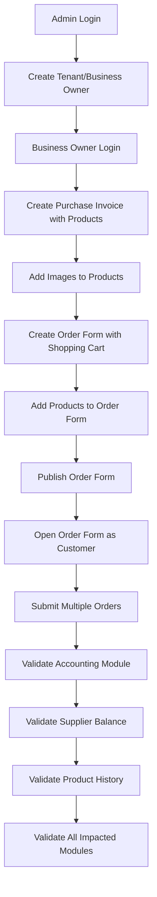

# Comprehensive End-to-End Test Case Document

## Overview
This document provides a complete test case for the QA team to validate the entire system flow from admin operations through order submission and validation of all impacted modules.

## Test Environment Setup
- **Backend URL**: http://localhost:5000/api
- **Frontend URL**: http://localhost:5173 (or configured port)
- **Database**: PostgreSQL (ensure database is clean or use test data)
- **Prerequisites**: 
  - Backend server running
  - Frontend server running
  - Database seeded with admin user (admin@orderms.com / admin123)

---

## Test Flow Overview



---

## Test Case 1: Admin Login

### Objective
Verify admin can successfully log in to the system.

### Steps
1. Navigate to frontend login page: `http://localhost:5173/login`
2. Enter credentials:
   - **Email**: `admin@orderms.com`
   - **Password**: `admin123`
3. Click "Login" button

### Expected Results
- ✅ Login successful
- ✅ Redirected to Admin Dashboard
- ✅ Admin user information displayed
- ✅ JWT token stored in browser
- ✅ Admin role permissions active

### Verification Points
- [ ] No error messages displayed
- [ ] Dashboard loads correctly
- [ ] Admin can see all admin-specific features
- [ ] Token is valid and stored

---

## Test Case 2: Create Tenant (Main Tenant/Business Owner)

### Objective
Verify admin can create a new tenant with an associated business owner user.

### Steps
1. From Admin Dashboard, navigate to "Tenants" or "Users" section
2. Click "Create Tenant" or "Add Business Owner" button
3. Fill in tenant details:
   - **Business Name**: `Test Fashion Store`
   - **Contact Person**: `John Smith`
   - **WhatsApp Number**: `+923001234567`
   - **Business Type**: `DRESS_SHOP` (or select from dropdown)
   - **Business Address**: `123 Test Street, Test City`
4. Fill in business owner user details:
   - **Name**: `John Smith`
   - **Email**: `john.smith@teststore.com`
   - **Password**: `test123456`
5. Click "Create" or "Save"

### Expected Results
- ✅ Tenant created successfully
- ✅ Business owner user created with role `BUSINESS_OWNER`
- ✅ Tenant linked to business owner
- ✅ Business code auto-generated
- ✅ Success message displayed

### Verification Points
- [ ] Tenant appears in tenants list
- [ ] Business owner user can be found in users list
- [ ] Tenant ID and Business Owner ID are linked
- [ ] Business code is unique and formatted correctly
- [ ] All tenant fields saved correctly

### API Verification (Optional)
```bash
# Verify tenant creation via API
GET /api/tenant
Authorization: Bearer {admin_token}

# Verify user creation
GET /api/auth/me
Authorization: Bearer {admin_token}
```

---

## Test Case 3: Business Owner Login

### Objective
Verify the newly created business owner can log in to the system.

### Steps
1. Logout from admin account (if still logged in)
2. Navigate to login page
3. Enter business owner credentials:
   - **Email**: `john.smith@teststore.com`
   - **Password**: `test123456`
4. Click "Login"

### Expected Results
- ✅ Login successful
- ✅ Redirected to Business Owner Dashboard
- ✅ Business owner sees tenant-specific data
- ✅ Business owner can access business owner features only

### Verification Points
- [ ] No error messages
- [ ] Dashboard shows tenant information
- [ ] Business owner cannot access admin-only features
- [ ] Tenant context is correctly loaded

---

## Test Case 4: Create Purchase Invoice with Products

### Objective
Verify business owner can create a purchase invoice with multiple products.

### Steps
1. From Business Owner Dashboard, navigate to "Purchases" or "Add Purchase"
2. Click "Add Purchase" or "New Purchase Invoice"
3. Fill in purchase invoice details:
   - **Supplier Name**: `Fashion Supplier Inc` (or select existing supplier)
   - **Invoice Number**: `INV-2024-001`
   - **Invoice Date**: Today's date
   - **Notes**: `Initial stock purchase`
4. Add products (at least 3 products):
   
   **Product 1:**
   - **Name**: `Red Cotton Dress`
   - **Description**: `Beautiful red cotton dress, size M`
   - **Category**: `Dresses`
   - **SKU**: `DRS-RED-M-001`
   - **Purchase Price**: `1500.00`
   - **Quantity**: `10`
   
   **Product 2:**
   - **Name**: `Blue Silk Scarf`
   - **Description**: `Premium blue silk scarf`
   - **Category**: `Accessories`
   - **SKU**: `SCF-BLU-001`
   - **Purchase Price**: `500.00`
   - **Quantity**: `20`
   
   **Product 3:**
   - **Name**: `Black Leather Handbag`
   - **Description**: `Elegant black leather handbag`
   - **Category**: `Bags`
   - **SKU**: `BAG-BLK-001`
   - **Purchase Price**: `3000.00`
   - **Quantity**: `5`
5. Verify total amount calculation: `(1500 × 10) + (500 × 20) + (3000 × 5) = 40,000`
6. Set payment status (choose one):
   - Option A: **Unpaid** (for testing supplier balance)
   - Option B: **Partially Paid** with payment amount `20,000` and select payment account
   - Option C: **Fully Paid** with payment amount `40,000` and select payment account
7. Click "Save" or "Create Purchase"

### Expected Results
- ✅ Purchase invoice created successfully
- ✅ All products added to invoice
- ✅ Products created in system (if new) or linked to existing products
- ✅ Product quantities updated in inventory
- ✅ Total amount calculated correctly
- ✅ Accounting entries created (if accounting module enabled)
- ✅ Supplier balance updated (if supplier exists)

### Verification Points
- [ ] Purchase invoice appears in purchases list
- [ ] All 3 products listed in invoice
- [ ] Product quantities in inventory increased correctly:
  - Red Cotton Dress: +10 units
  - Blue Silk Scarf: +20 units
  - Black Leather Handbag: +5 units
- [ ] Product purchase prices updated
- [ ] Total amount matches calculation
- [ ] Payment status displayed correctly
- [ ] Invoice number is unique

### Database Verification
- [ ] `PurchaseInvoice` record created
- [ ] `PurchaseItem` records created (3 items)
- [ ] `Product` records created/updated (3 products)
- [ ] `Product.currentQuantity` updated correctly
- [ ] `ProductLog` entries created for quantity changes
- [ ] `Transaction` records created (if accounting enabled)
- [ ] `Supplier` record created/updated (if supplier name used)

---

## Test Case 5: Add Images to Products

### Objective
Verify business owner can add images to products created from purchase invoice.

### Steps
1. Navigate to "Products" page from dashboard
2. Find the products created in Test Case 4:
   - Red Cotton Dress
   - Blue Silk Scarf
   - Black Leather Handbag
3. For each product, add an image:
   
   **For Red Cotton Dress:**
   - Click on product card or "Edit" button
   - Click "Add Image" or "Upload Image" button
   - Choose upload method:
     - Option A: Upload from file (select image file)
     - Option B: Capture from camera
   - Select/capture image
   - Click "Upload" or "Save"
   
   **Repeat for Blue Silk Scarf and Black Leather Handbag**

### Expected Results
- ✅ Images uploaded successfully for all products
- ✅ Images displayed in product list
- ✅ Images displayed in product detail view
- ✅ Image data stored in database
- ✅ Product logs updated with image upload action

### Verification Points
- [ ] All 3 products have images
- [ ] Images display correctly in product cards
- [ ] Images can be viewed in full size
- [ ] Image upload creates `ProductLog` entry with action `IMAGE_UPLOADED`
- [ ] Product `imageData` and `imageType` fields populated
- [ ] Images accessible via image API endpoint

### API Verification
```bash
# Verify image upload
GET /api/images/product/{productId}
Authorization: Bearer {business_owner_token}

# Verify product log
GET /api/product/{productId}/history
Authorization: Bearer {business_owner_token}
```

---

## Test Case 6: Create Order Form with Shopping Cart Category

### Objective
Verify business owner can create an order form with shopping cart functionality.

### Steps
1. Navigate to "Forms" page from dashboard
2. Click "Create Form" or "New Form" button
3. Fill in form details:
   - **Form Name**: `Summer Collection Order Form`
   - **Description**: `Order form for summer fashion collection`
   - **Form Category**: Select `SHOPPING_CART` (Product Catalog)
4. Add form fields (customer information):
   - **Field 1:**
     - Label: `Customer Name`
     - Type: `TEXT`
     - Required: Yes
     - Placeholder: `Enter your full name`
     - Order: 1
   
   - **Field 2:**
     - Label: `Phone Number`
     - Type: `PHONE`
     - Required: Yes
     - Placeholder: `Enter your phone number`
     - Order: 2
   
   - **Field 3:**
     - Label: `Email Address`
     - Type: `EMAIL`
     - Required: No
     - Placeholder: `Enter your email`
     - Order: 3
   
   - **Field 4:**
     - Label: `Delivery Address`
     - Type: `TEXTAREA`
     - Required: Yes
     - Placeholder: `Enter complete delivery address`
     - Order: 4
   
   - **Field 5:**
     - Label: `City`
     - Type: `TEXT`
     - Required: Yes
     - Placeholder: `Enter your city`
     - Order: 5
5. Click "Save" or "Create Form"

### Expected Results
- ✅ Form created successfully
- ✅ Form category set to `SHOPPING_CART`
- ✅ All form fields saved
- ✅ Form appears in forms list
- ✅ Form is in draft state (not published)

### Verification Points
- [ ] Form created with correct name and description
- [ ] Form category is `SHOPPING_CART`
- [ ] All 5 form fields created with correct properties
- [ ] Field order is correct (1-5)
- [ ] Required fields marked correctly
- [ ] Form `isPublished` is `false`
- [ ] Form `formLink` is `null` (not yet published)

---

## Test Case 7: Add Products to Order Form

### Objective
Verify business owner can add products to the shopping cart order form.

### Steps
1. From the form created in Test Case 6, click "Edit" or open form details
2. Navigate to "Products" section or "Add Products" tab
3. Add products to the form:
   - Select "Red Cotton Dress" from product list
   - Set retail price: `2500.00` (if not auto-filled)
   - Click "Add to Form"
   
   - Select "Blue Silk Scarf" from product list
   - Set retail price: `800.00`
   - Click "Add to Form"
   
   - Select "Black Leather Handbag" from product list
   - Set retail price: `4500.00`
   - Click "Add to Form"
4. Verify all 3 products appear in form's product list
5. Optionally, set product display order or categories
6. Save form

### Expected Results
- ✅ Products added to form successfully
- ✅ Products will be available in shopping cart when form is published
- ✅ Product prices set correctly
- ✅ Form updated with product associations

### Verification Points
- [ ] All 3 products linked to form
- [ ] Product prices saved correctly
- [ ] Products will appear in shopping cart interface
- [ ] Form can be saved with products
- [ ] Product availability checked (quantities > 0)

### Note
The exact implementation may vary. Products might be:
- Stored in `FormField.selectedProducts` (JSON)
- Linked via a separate form-products relationship
- Available from all tenant products when form is accessed

---

## Test Case 8: Publish Order Form

### Objective
Verify business owner can publish the order form to make it accessible to customers.

### Steps
1. From forms list, find "Summer Collection Order Form"
2. Click "Publish" button or toggle publish status
3. Confirm publication (if confirmation dialog appears)
4. Note the generated form link (if displayed)

### Expected Results
- ✅ Form published successfully
- ✅ `isPublished` status changed to `true`
- ✅ Unique `formLink` generated
- ✅ Form URL created (e.g., `http://localhost:5173/form/{formLink}`)
- ✅ Success message displayed
- ✅ Form accessible via public link

### Verification Points
- [ ] Form status shows "Published"
- [ ] Form link is generated and unique
- [ ] Form link is a valid URL
- [ ] Form can be accessed without authentication
- [ ] `isPublished` field is `true` in database
- [ ] `formLink` field is populated

### API Verification
```bash
# Verify form is published
GET /api/form/{formId}
Authorization: Bearer {business_owner_token}

# Verify form is accessible via link
GET /api/form/link/{formLink}
```

---

## Test Case 9: Open Order Form and Submit Orders

### Objective
Verify customers can access the published form and submit orders with products.

### Steps

### Order 1: Full Order with All Products
1. Open form in new browser/incognito window (simulating customer)
2. Navigate to form URL: `http://localhost:5173/form/{formLink}`
3. Verify form loads correctly with shopping cart interface
4. Fill in customer information:
   - **Customer Name**: `Alice Johnson`
   - **Phone Number**: `+923001111111`
   - **Email Address**: `alice.johnson@email.com`
   - **Delivery Address**: `456 Customer Street, City A`
   - **City**: `Lahore`
5. Add products to cart:
   - Add "Red Cotton Dress" - Quantity: 2
   - Add "Blue Silk Scarf" - Quantity: 3
   - Add "Black Leather Handbag" - Quantity: 1
6. Verify cart total: `(2500 × 2) + (800 × 3) + (4500 × 1) = 11,900`
7. Select payment method:
   - **Payment Method**: `Cash on Delivery` (or `Prepaid` if testing prepayment)
   - If prepaid: Enter payment amount and upload receipt (optional)
8. Review order summary
9. Click "Submit Order" or "Place Order"
10. Note the order number from confirmation

### Order 2: Partial Order with Single Product
1. Open form again (or refresh)
2. Fill in customer information:
   - **Customer Name**: `Bob Williams`
   - **Phone Number**: `+923002222222`
   - **Email Address**: `bob.williams@email.com`
   - **Delivery Address**: `789 Another Street, City B`
   - **City**: `Karachi`
3. Add products to cart:
   - Add "Red Cotton Dress" - Quantity: 1
   - Add "Blue Silk Scarf" - Quantity: 2
4. Verify cart total: `(2500 × 1) + (800 × 2) = 4,100`
5. Select payment method: `Cash on Delivery`
6. Submit order
7. Note the order number

### Order 3: Single Product Order
1. Open form again
2. Fill in customer information:
   - **Customer Name**: `Carol Davis`
   - **Phone Number**: `+923003333333`
   - **Email Address**: `carol.davis@email.com`
   - **Delivery Address**: `321 Third Street, City C`
   - **City**: `Islamabad`
3. Add products to cart:
   - Add "Black Leather Handbag" - Quantity: 1
4. Verify cart total: `4500.00`
5. Select payment method: `Prepaid`
   - Payment amount: `4500.00`
   - Upload payment receipt (optional)
6. Submit order
7. Note the order number

### Expected Results
- ✅ All 3 orders submitted successfully
- ✅ Orders appear in business owner's order list
- ✅ Customer records created/updated for each order
- ✅ Product quantities decreased in inventory
- ✅ Order numbers generated and unique
- ✅ Order status set to "PENDING"
- ✅ Order data stored correctly

### Verification Points
- [ ] All 3 orders visible in orders list
- [ ] Order numbers are unique (e.g., ORD-2024-001, ORD-2024-002, ORD-2024-003)
- [ ] Customer information saved correctly:
  - Alice Johnson: Phone +923001111111
  - Bob Williams: Phone +923002222222
  - Carol Davis: Phone +923003333333
- [ ] Products in orders match cart selections
- [ ] Product quantities in orders correct
- [ ] Order totals calculated correctly
- [ ] Payment information saved (if prepaid)
- [ ] Product inventory decreased:
  - Red Cotton Dress: 10 - 2 - 1 = 7 remaining
  - Blue Silk Scarf: 20 - 3 - 2 = 15 remaining
  - Black Leather Handbag: 5 - 1 - 1 = 3 remaining

### Database Verification
- [ ] `Order` records created (3 orders)
- [ ] `Customer` records created/updated (3 customers)
- [ ] `Product.currentQuantity` updated correctly
- [ ] `ProductLog` entries created for sales
- [ ] `Order.selectedProducts` stored correctly
- [ ] `Order.productQuantities` stored correctly
- [ ] `Order.productPrices` stored correctly
- [ ] `CustomerLog` entries created (if applicable)

---

## Test Case 10: Validate Accounting Module

### Objective
Verify all accounting entries are created correctly for purchases and orders.

### Steps
1. Login as business owner
2. Navigate to "Accounting" or "Chart of Accounts"
3. Verify accounting entries for purchase invoice (from Test Case 4):

### Purchase Invoice Accounting
- **Transaction Type**: Purchase Invoice
- **Debit**: Inventory Account (1300) - Rs. 40,000
- **Credit**: Accounts Payable (2000) - Rs. 40,000 (if unpaid) OR Payment Account (if paid)

4. Verify accounting entries for orders (if accounting integrated):

### Order Accounting (if applicable)
- **Transaction Type**: Sales Order
- **Debit**: Accounts Receivable (1200) - Order amounts
- **Credit**: Sales Revenue (4000) - Order amounts

5. Check accounting dashboard summaries:
   - Total Receivables
   - Total Payables
   - Cash Position
   - Inventory Value

### Expected Results
- ✅ All accounting transactions created
- ✅ Double-entry bookkeeping balanced (Debits = Credits)
- ✅ Account balances updated correctly
- ✅ Transactions linked to purchase invoices and orders
- ✅ Accounting dashboard shows correct summaries

### Verification Points
- [ ] Purchase invoice transaction exists
- [ ] Inventory account debited correctly
- [ ] Accounts Payable credited correctly (if unpaid)
- [ ] Payment account credited correctly (if paid)
- [ ] Order transactions created (if accounting for orders)
- [ ] All transactions balanced
- [ ] Journal entries show correct descriptions
- [ ] Transaction dates are correct
- [ ] Account ledgers show correct running balances

### Database Verification
- [ ] `Transaction` records exist
- [ ] `TransactionLine` records created with correct debit/credit amounts
- [ ] `Account.balance` updated correctly
- [ ] Transactions linked to `PurchaseInvoice` and `Order`

---

## Test Case 11: Validate Supplier Balance

### Objective
Verify supplier balance calculations are correct after purchase invoice creation.

### Steps
1. Navigate to "Suppliers" page
2. Find "Fashion Supplier Inc" (or supplier used in Test Case 4)
3. View supplier details and balance information
4. Verify balance calculation:
   - **Opening Balance**: 0 (if new supplier) or existing balance
   - **Purchase Invoices Total**: Rs. 40,000 (from Test Case 4)
   - **Payments Made**: Rs. 0 (if unpaid) or payment amount (if paid)
   - **Current Balance**: Opening + Purchases - Payments

5. Check supplier ledger (if available):
   - Opening balance entry
   - Purchase invoice entry
   - Payment entries (if any)

### Expected Results
- ✅ Supplier balance calculated correctly
- ✅ Balance shows as "Pending" (positive) if unpaid
- ✅ Balance shows as "Paid" if fully paid
- ✅ Supplier ledger shows all transactions
- ✅ Balance updates correctly after payments

### Verification Points
- [ ] Supplier balance matches calculation
- [ ] Balance type correct (Pending/Advance)
- [ ] Purchase invoice linked to supplier
- [ ] Payment records linked (if payments made)
- [ ] Supplier ledger chronological
- [ ] Running balance calculated correctly
- [ ] Balance displayed in supplier list

### Database Verification
- [ ] `Supplier.balance` field updated
- [ ] `PurchaseInvoice.supplierId` linked correctly
- [ ] `Payment` records linked to supplier (if payments made)

---

## Test Case 12: Validate Product History

### Objective
Verify product history/logs are created correctly for all product operations.

### Steps
1. Navigate to "Products" page
2. For each product, view product history:

### Red Cotton Dress History
- Click on product or "View History"
- Verify history entries:
  1. **PURCHASE** entry:
     - Quantity: +10
     - Purchase Price: 1500.00
     - Reference: Purchase Invoice INV-2024-001
     - Date: Purchase invoice date
  
  2. **IMAGE_UPLOADED** entry:
     - Action: IMAGE_UPLOADED
     - Reference: Product image upload
     - Date: Image upload date
  
  3. **SALE** entries (from orders):
     - Order 1: Quantity -2, Sale Price: 2500.00
     - Order 2: Quantity -1, Sale Price: 2500.00
     - Reference: Order numbers

### Blue Silk Scarf History
- Verify similar entries:
  1. PURCHASE: +20, Price: 500.00
  2. IMAGE_UPLOADED
  3. SALE entries: -3, -2

### Black Leather Handbag History
- Verify similar entries:
  1. PURCHASE: +5, Price: 3000.00
  2. IMAGE_UPLOADED
  3. SALE entries: -1, -1

### Expected Results
- ✅ All product operations logged
- ✅ History entries chronological
- ✅ Quantity changes tracked correctly
- ✅ Price changes tracked
- ✅ References to invoices and orders
- ✅ Action types correct

### Verification Points
- [ ] All products have history entries
- [ ] Purchase entries logged
- [ ] Image upload entries logged
- [ ] Sale entries logged for each order
- [ ] Quantity changes accurate (old/new quantities)
- [ ] Price information recorded
- [ ] References to purchase invoices and orders
- [ ] Timestamps correct
- [ ] History sorted by date (newest first or oldest first)

### Database Verification
- [ ] `ProductLog` records exist for all operations
- [ ] `ProductLog.action` values correct
- [ ] `ProductLog.quantity` changes tracked
- [ ] `ProductLog.oldQuantity` and `newQuantity` populated
- [ ] `ProductLog.purchaseItemId` linked (for purchases)
- [ ] `ProductLog` references correct

---

## Test Case 13: Validate All Impacted Modules

### Objective
Verify all system modules are functioning correctly after the complete flow.

### Steps

### 13.1 Customer Module Validation
1. Navigate to "Customers" page
2. Verify 3 customers created:
   - Alice Johnson (+923001111111)
   - Bob Williams (+923002222222)
   - Carol Davis (+923003333333)
3. For each customer, verify:
   - Customer information correct
   - Total orders count: 1 for each
   - Total spent amount matches order total
   - Last order date populated
   - Customer logs exist

### 13.2 Inventory Module Validation
1. Navigate to "Products" or "Inventory" page
2. Verify product quantities:
   - Red Cotton Dress: 7 remaining (10 - 2 - 1)
   - Blue Silk Scarf: 15 remaining (20 - 3 - 2)
   - Black Leather Handbag: 3 remaining (5 - 1 - 1)
3. Verify inventory value calculations
4. Check low stock alerts (if quantities below threshold)

### 13.3 Orders Module Validation
1. Navigate to "Orders" page
2. Verify all 3 orders listed
3. For each order, verify:
   - Order number unique
   - Customer linked correctly
   - Products in order correct
   - Quantities correct
   - Prices correct
   - Total amount correct
   - Status: PENDING
   - Form linked correctly
4. Test order status updates (if applicable)
5. Test order filtering and search

### 13.4 Forms Module Validation
1. Navigate to "Forms" page
2. Verify "Summer Collection Order Form":
   - Status: Published
   - Form link active
   - Products available in form
   - Form fields correct
3. Test form accessibility via public link
4. Verify form statistics (order count, etc.)

### 13.5 Purchase Module Validation
1. Navigate to "Purchases" page
2. Verify purchase invoice:
   - Invoice number: INV-2024-001
   - Total amount: 40,000
   - Products listed correctly
   - Supplier linked
   - Payment status correct
3. Test purchase invoice editing
4. Test payment recording (if unpaid)

### 13.6 Supplier Module Validation
1. Navigate to "Suppliers" page
2. Verify supplier:
   - Name: Fashion Supplier Inc
   - Balance calculated correctly
   - Purchase invoices linked
   - Payment history (if payments made)
3. Test supplier editing
4. Test supplier ledger view

### 13.7 Product Module Validation
1. Navigate to "Products" page
2. Verify all products:
   - Products created from purchase
   - Images uploaded
   - Quantities updated
   - Prices set
   - Categories assigned
   - SKUs assigned
3. Test product editing
4. Test product history viewing
5. Test product search and filtering

### 13.8 Accounting Module Validation (Detailed)
1. Navigate to "Accounting" dashboard
2. Verify:
   - Chart of Accounts
   - Account balances
   - Transaction journal
   - Financial summaries
3. Verify specific accounts:
   - Inventory (1300): Increased by purchase amount
   - Accounts Payable (2000): Increased if unpaid
   - Cash/Bank accounts: Decreased if payments made
   - Accounts Receivable (1200): Increased by order amounts (if applicable)
   - Sales Revenue (4000): Increased by order amounts (if applicable)
4. Test transaction filtering
5. Test account ledger views
6. Verify double-entry balance (Debits = Credits)

### 13.9 Reporting Module Validation (if available)
1. Navigate to "Reports" or "Analytics"
2. Verify reports show:
   - Sales summary
   - Purchase summary
   - Inventory status
   - Customer statistics
   - Product performance
3. Test report date ranges
4. Test report exports (if available)

### Expected Results
- ✅ All modules functioning correctly
- ✅ Data consistency across modules
- ✅ Relationships maintained (orders → customers, orders → products, etc.)
- ✅ Calculations accurate
- ✅ No data corruption
- ✅ Performance acceptable

### Verification Points
- [ ] Customer module: All customers created, data correct
- [ ] Inventory module: Quantities accurate, calculations correct
- [ ] Orders module: All orders visible, data complete
- [ ] Forms module: Form published, accessible, functional
- [ ] Purchase module: Invoice created, linked correctly
- [ ] Supplier module: Balance correct, transactions linked
- [ ] Product module: All products exist, history complete
- [ ] Accounting module: All transactions balanced, accounts correct
- [ ] Reporting module: Reports accurate (if available)
- [ ] Cross-module relationships: All links valid
- [ ] Data integrity: No orphaned records
- [ ] Performance: Page loads < 2 seconds

---

## Test Case 14: Edge Cases and Error Handling

### Objective
Verify system handles edge cases and errors gracefully.

### Steps

### 14.1 Insufficient Stock
1. Try to add product to cart with quantity exceeding available stock
2. Verify system prevents or warns about insufficient stock

### 14.2 Invalid Form Data
1. Try to submit order with missing required fields
2. Verify validation errors displayed

### 14.3 Duplicate Order Submission
1. Try to submit same order twice quickly
2. Verify system prevents duplicates or handles gracefully

### 14.4 Large Order
1. Create order with very large quantities
2. Verify system handles large numbers correctly

### 14.5 Special Characters
1. Use special characters in customer names, addresses
2. Verify data saved and displayed correctly

### Expected Results
- ✅ Validation errors displayed clearly
- ✅ System prevents invalid operations
- ✅ Error messages user-friendly
- ✅ No system crashes
- ✅ Data integrity maintained

---

## Test Case 15: Performance and Load Testing

### Objective
Verify system performance under normal load.

### Steps
1. Measure page load times for:
   - Dashboard
   - Products list
   - Orders list
   - Forms list
   - Accounting dashboard
2. Measure API response times:
   - Login
   - Create purchase
   - Create order
   - Get products
   - Get orders
3. Test with multiple concurrent users (if possible)

### Expected Results
- ✅ Page loads < 2 seconds
- ✅ API responses < 500ms
- ✅ No performance degradation
- ✅ Database queries optimized

---

## Test Summary Checklist

### Pre-Test Setup
- [ ] Backend server running
- [ ] Frontend server running
- [ ] Database accessible
- [ ] Admin user exists
- [ ] Test environment clean

### Test Execution
- [ ] Test Case 1: Admin Login - PASSED
- [ ] Test Case 2: Create Tenant - PASSED
- [ ] Test Case 3: Business Owner Login - PASSED
- [ ] Test Case 4: Create Purchase Invoice - PASSED
- [ ] Test Case 5: Add Product Images - PASSED
- [ ] Test Case 6: Create Order Form - PASSED
- [ ] Test Case 7: Add Products to Form - PASSED
- [ ] Test Case 8: Publish Form - PASSED
- [ ] Test Case 9: Submit Orders - PASSED
- [ ] Test Case 10: Validate Accounting - PASSED
- [ ] Test Case 11: Validate Supplier Balance - PASSED
- [ ] Test Case 12: Validate Product History - PASSED
- [ ] Test Case 13: Validate All Modules - PASSED
- [ ] Test Case 14: Edge Cases - PASSED
- [ ] Test Case 15: Performance - PASSED

### Post-Test Validation
- [ ] All data persisted correctly
- [ ] No data corruption
- [ ] All relationships intact
- [ ] Accounting balanced
- [ ] No errors in logs
- [ ] Performance acceptable

---

## Test Data Summary

### Created Entities
- **Tenants**: 1 (Test Fashion Store)
- **Users**: 1 Business Owner (John Smith)
- **Suppliers**: 1 (Fashion Supplier Inc)
- **Purchase Invoices**: 1 (INV-2024-001)
- **Products**: 3 (Red Cotton Dress, Blue Silk Scarf, Black Leather Handbag)
- **Forms**: 1 (Summer Collection Order Form)
- **Orders**: 3 (ORD-2024-001, ORD-2024-002, ORD-2024-003)
- **Customers**: 3 (Alice Johnson, Bob Williams, Carol Davis)

### Financial Summary
- **Purchase Total**: Rs. 40,000
- **Sales Total**: Rs. 20,500 (11,900 + 4,100 + 4,500)
- **Inventory Value**: Based on purchase prices
- **Supplier Balance**: Rs. 40,000 (if unpaid) or adjusted if paid

---

## Notes and Observations

### Important Notes
1. **Payment Accounts**: Ensure payment accounts (Cash/Bank) exist before making payments
2. **Product Images**: Image upload may require specific file formats (JPG, PNG, WebP)
3. **Form Publishing**: Once published, form link is permanent (unless unpublished)
4. **Order Numbers**: Auto-generated, format may vary
5. **Customer Creation**: Customers auto-created from order submissions
6. **Inventory Updates**: Real-time updates on purchase and order creation

### Known Limitations
- List any known system limitations or workarounds
- Document any manual steps required
- Note any browser-specific requirements

### Troubleshooting
- **Login Issues**: Verify credentials, check backend logs
- **Form Not Loading**: Verify form is published, check formLink
- **Image Upload Fails**: Check file size, format, permissions
- **Accounting Not Balanced**: Verify all transactions created, check account codes
- **Product Quantities Wrong**: Check ProductLog entries, verify calculations

---

## Sign-Off

### Test Executed By
- **Name**: _________________
- **Date**: _________________
- **Time**: _________________

### Test Results
- **Total Test Cases**: 15
- **Passed**: _____
- **Failed**: _____
- **Blocked**: _____

### Comments
_________________________________________________________________
_________________________________________________________________
_________________________________________________________________

### Approval
- **QA Lead**: _________________ Date: _________
- **Development Lead**: _________________ Date: _________

